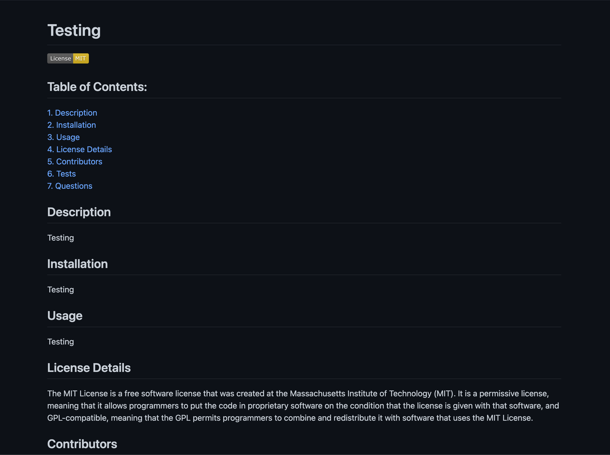
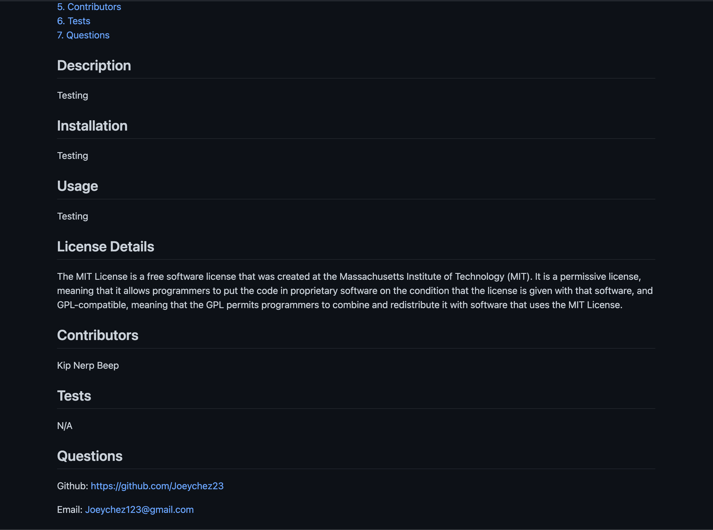

# README.md Generator

##Description

This project uses Node.js to run Node in the terminal, Once in the terminals you can call the command node index.js to start the JS files. The files has a set of Questions prompts for the user and with Question to build the README.md file, using inquirer to ask the questions and fs to append the file. Once the user inputs meet the requirements the README.md file is created and is ready for use. The created README will be located in the public/ file and to run the code you'll need to clone the repo below.

## Output

Pictures of the site will be provided bellow:

## Pages

N/A

## Repo

https://github.com/Joeychez23/09-README-GEN
